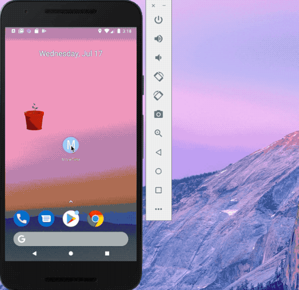
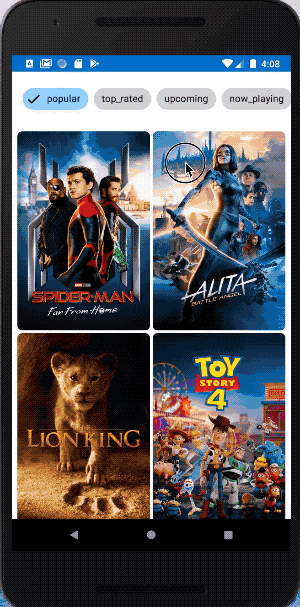

# *MovieTime*

**MovieTime** shows the latest movies currently playing in theaters. The app utilizes the [Movie Database API](https://developers.themoviedb.org/3/movies/get-movie-details) to display images and basic information about these movies to the user.

Time spent: A week spent in total

## User Stories

I use **Kotlin** to compelete this Application. The following **required** functionality is completed:

* [X] User can **scroll through current movies** from the Movie Database API
* [X] For each movie displayed, user can see the following details:
  * [X] Title, Poster Image, Overview (Portrait mode), Runtime, Movie type
  * [X] Title, Backdrop Image, Overview (Landscape mode), Runtime, Movie type
* [X] Layout is optimized with the **RecyclerView** pattern.

The following **optional** features are implemented:

* [X] User can **pull-to-refresh** popular stream to get the latest movies.
* [X] The lateset movies will be stored in the **Database**. When there is no reliable network connection, the users can also see some information of the movies.
* [X] Display a **loading indicator** for each image during loading.
* [X] Improved the user interface through styling and coloring.
    * [X] Add margin or padding for each elements in movie item
    * [X] Custom the background the color of movie list

The following **bonus** features are implemented:

* [X] Use **ViewModel** and **LiveData** to optimize the Architecture.
* [X] Use **BindingAdapter** and **data transform** to bind the data and reduce codes.
* [X] Use **Dao** and **Room Database** to generate our database.
* [X] Use **Coroutine** to get data on the background thread.
* [X] Use **Retrofit** to get the data in the Movie DB Api, and use **Moshi** to tranform into our data structure.
* [X] Allow user to view details of the movie including ratings and popularity within a separate activity or dialog fragment.
* [X] YouTubePlayer can be continously run when rotate the phone. 
* [X] Allow video trailers to be played in full-screen using the YouTubePlayerView.
* [X] Overlay a play icon for videos that can be played.
* [X] Apply the popular [Data-binding library](https://developer.android.com/topic/libraries/data-binding) to reduce boilerplate code.
* [X] Apply rounded corners for the poster or background images using **Glide** transformations.

The following **additional** features are implemented:

* [X] Use Fragment
* [X] Use navigation
* [X] Add launch icon

## Video Walkthrough

Here's a walkthrough of implemented user stories:

## Open-source libraries used

- Retrofit
- Moshi
- ViewModel
- LiveData
- Constraint Layout
- Coroutines
- Glide
- Room database

## License

    Copyright 2019 Yini Duanmu

    Licensed under the Apache License, Version 2.0 (the "License");
    you may not use this file except in compliance with the License.
    You may obtain a copy of the License at

        http://www.apache.org/licenses/LICENSE-2.0

    Unless required by applicable law or agreed to in writing, software
    distributed under the License is distributed on an "AS IS" BASIS,
    WITHOUT WARRANTIES OR CONDITIONS OF ANY KIND, either express or implied.
    See the License for the specific language governing permissions and
    limitations under the License.